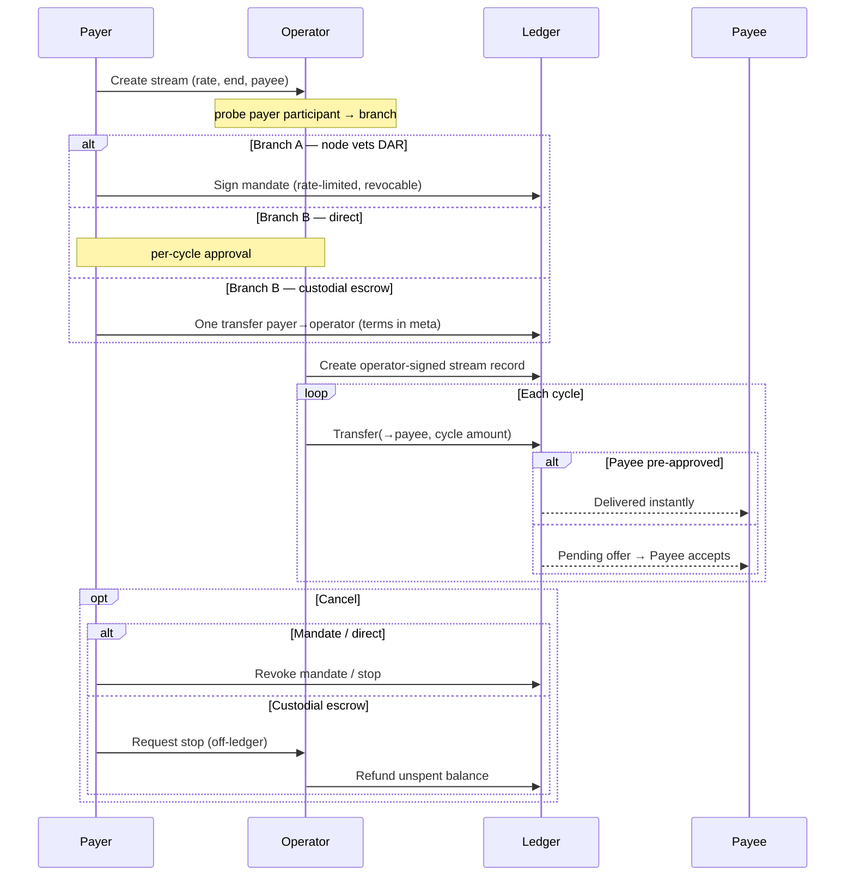

# Streaming settlement & delivery design

How value moves in a payment stream, decided per signed-in user by what
their participant actually supports.

## The one rule everything follows

A payment stream is a two-party relationship: a **payer** pays a **payee**
over time at a fixed rate. To move the payer's funds on a schedule you must
give up exactly one of three properties — this is Canton's authorization
model, not an application limitation:

| Delivery model | Non-custodial (funds stay with payer) | No per-cycle signature | No DAR vetting on payer's node | Gives up |
| --- | :---: | :---: | :---: | --- |
| **Direct delivery** | yes | no — signs each cycle | yes | per-cycle signing |
| **Mandate** | yes | yes | no — thin DAR | DAR-free |
| **Custodial escrow** | no — operator holds | yes | yes | non-custody |

The fact underneath: to be a `signatory` on any of our contracts, the
payer's participant **must vet our DAR**. Daml interfaces do not change this
— they let a party *interact with* another participant's contracts via an
interface projection, not *create or sign* ours. Verified live: a
`signatory sender` create from a custodial (Loop) wallet returns
`PACKAGE_NAMES_NOT_FOUND`.

## Routing — probe, then branch

On sign-in, read a `canton-streams` template through the connected party's
ledger. The read rejects cleanly with `PACKAGE_NAMES_NOT_FOUND` when the
participant does not vet our DAR (the write path hangs instead, so a read is
the reliable signal). Any non-success degrades to **direct delivery only** —
the one path that works on every participant.

- **Vets our DAR** → Branch A (richer set)
- **Does not vet** → Branch B (direct + custodial escrow)
- **Unknown / probing** → direct delivery only (fail-safe)

Direct delivery is the universal baseline because its money leg is the CIP-56
token-standard transfer, vetted on every participant. Custody and the mandate
both put a `canton-streams` contract signed by the payer on-ledger, so both
require the DAR on the payer's participant.

## Roles

| Role | Responsibility | Holds funds? |
| --- | --- | --- |
| **Payer** (sender) | Authorizes funding — once (mandate / escrow deposit) or per cycle | Direct & mandate: yes, in their own wallet. Escrow: no — deposited to operator |
| **Payee** (recipient) | Optionally pre-approves incoming transfers; otherwise accepts each | No |
| **Operator** | Hosts the DAR, runs the executor, submits, pays traffic | Only in the **custodial escrow** model |
| **Registry / issuer** | Provides the asset's transfer rules (e.g. the DSO for Canton Coin) via disclosed contracts | No |

## The money leg — direct transfer, not allocation

Each cycle moves value with the token standard's **transfer** primitive
(`TransferFactory_Transfer` → `TransferInstruction`). Per CIP-56 this choice
is **controlled by the sender alone** — the instrument admin is *validated* as
the expected registry but is **not** a required signer; it contributes the
asset's rules through disclosed contracts. A transfer is a genuine two-party
operation: the sender authorizes it, the receiver accepts it (or has
pre-approved it, in which case it completes immediately), and no operator or
escrow agent is in the value path. Transfers settle cross-node to any receiver.

The token standard also offers an **allocation** primitive (lock up front,
settle later). Its settle/cancel choices are controlled by
**sender + receiver + executor** (three-party) and, for Amulet, drag in the
DSO. Allocations exist for delivery-versus-payment, not one-directional
streams — and on this network `Allocation_Settle` is DSO-gated, so the
allocation path cannot settle here at all.

## Branch A — payer's node vets our DAR

For our validator's parties, dApp-SDK / SWK, and self-hosted nodes running our
DAR.

- **Mandate — the headline.** Payer signs one application contract that grants
  the operator a **rate-limited, revocable** authority to pull at most one
  cycle's amount per period. Funds stay in the payer's wallet; the payer
  revokes anytime and a faulty operator can move at most the scheduled rate.
  Sign once, run continuously — non-custodial.
- **Direct delivery.** Signs each cycle. Always available.
- **Allocation custody / Flow.** Lock-based streams. They create, but the
  settle leg is DSO-gated on this network — hidden or marked record-only.

## Branch B — payer's node does not vet our DAR

For every custodial wallet (Loop) and any external wallet.

- **Direct delivery — the default.** One token-standard transfer per cycle,
  signed in the wallet. Nothing locked; works with any wallet.
- **Custodial escrow.** Payer funds the operator once; the operator streams
  out.

### Custodial escrow — how it runs

1. **Fund** — payer signs one transfer `payer → operator` for the total, with
   `meta = {recipient, rate, periods}` — a signed, on-ledger receipt of intent.
   No DAR vetting.
2. **Record** — operator-signed escrow contract stores
   `{payer, recipient, rate, released, fundingTransferId}`. The payer is **not**
   a stakeholder.
3. **Stream** — the operator transfers one cycle's amount to the recipient on
   schedule and bumps `released`. No further payer signature.
4. **Stop / refund** — payer asks the app off-ledger; operator returns the
   unspent balance. **Operator-mediated** (the payer cannot self-exercise).

### Custody is the real cost of this model

- The escrow "vault" is a **party on our validator; its keys are the node's
  keys** — whoever runs the node controls every escrowed coin. A hot,
  fund-holding honeypot.
- Hardening: dedicated escrow party, **HSM/KMS keys**, ideally **threshold
  multi-hosting** (N operators must co-sign to release), monitoring, and a
  guaranteed refund path.
- Holding customer funds carries **regulatory weight** (money-transmission /
  custody). The UI must state plainly that the payer deposits to the operator —
  never imply non-custodial.
- The signed-intent receipt gives **proof and auditability, not enforcement** —
  deviation becomes provable, not impossible.

### Two "escrows" — do not confuse them

- **Allocation lock** (Branch A): non-custodial, funds locked in an on-ledger
  allocation the payer signs. DSO-gated here.
- **Custodial escrow** (Branch B): the operator party *holds* the funds. Same
  word, opposite trust model. Name them distinctly in the UI.

## The recipient dimension (orthogonal to the branches)

Routing is about the payer; whether a cycle *lands* depends on the recipient:

- Recipient holds a **`TransferPreapproval`** → each cycle auto-delivers.
- Recipient has none → each cycle is a pending offer they accept in their wallet.

A preapproval is **receiver-signed** — the application cannot create it on the
payee's behalf. A recipient-side step detects it and offers one-click setup so
streams deliver hands-free. Applies to all models, including the escrow's
outbound leg.

## The stream record

The stream — schedule, rate, lifecycle state — is an **operator-signed**
application contract. Payer and payee are **fields**, not signatories or
observers, so only the operator's participant is a stakeholder and only it must
vet the DAR. The payee (and a mandate-less payer) are never stakeholders, so
their nodes need nothing installed. The record is the operator's index; the
authoritative value movement is the stream of standard transfers.

## Topology and package vetting

A Canton contract can be created only where **every participant hosting a
stakeholder** vets its package. That shapes the roles above:

- **Receiving is universal.** A transfer makes the receiver a stakeholder only
  on a *standard* token contract every participant already vets.
- **The application is the operator's concern.** Payer/payee aren't stakeholders
  on the stream record, so only the operator's participant vets the DAR.
- **The mandate and the allocation lock are the exceptions.** Both are signed by
  the payer, so the payer's participant must vet the package — which is exactly
  why they live in Branch A, and custodial wallets fall back to direct delivery
  or the custodial escrow.

## Build status

| Capability | Status | Note |
| --- | --- | --- |
| Vetting probe + capability routing | **Live** | Gates custody create, the lane switch, and Flows. |
| Direct delivery (any wallet) | **Live** | Per-cycle transfer; operator-signed `StreamRecord` index. |
| Recipient accept / received view | **Live** | Pending-offer accept path proven cross-node. |
| Mandate — bookkeeping (create / RecordPull / Revoke) | **Template proven** | Rate-limited record; proxy endpoints pending. |
| Mandate — trust-minimized pull | **Blocked** | The in-choice `PullCycle` that executes the transfer needs a consistent token-standard DAR set; descoped until the transfer-instruction dep hashes align. Until then the operator can pull only for parties it hosts. |
| Custodial escrow flow | **Live (hardening in progress)** | Escrow party + proxy-submitted deposit + streamer + refund move real CC (`packages/proxy/src/escrow.ts`). In place: payer-only + cadence-gated release, validated inputs, atomic store. Outstanding before real-fund use: on-chain deposit verification (client-attested deposits are disabled by default) and per-escrow fund segregation (funds are currently commingled in one escrow party). |
| Recipient one-click preapproval | **To build** | Preapproval *creation* is a wallet/validator action; we detect + trigger, not sign. |
| Allocation settle (custody / Flow money leg) | **Blocked** | `Allocation_Settle` DSO-gated on this network — record-only until settlement rights exist. |

## Open decisions

1. **Offer the custodial escrow at all?** Smoothest UX for non-vetting wallets,
   but it makes us a custodian (funds, keys, regulation).
2. **If custodial, hardening bar for launch?** Dedicated escrow party is table
   stakes; HSM keys and threshold multi-hosting are the real protections.
3. **Naming.** "Allocation lock" vs "Operator-custodied stream".
4. **Build order.** Suggested: recipient one-click preapproval → mandate
   endpoints (hosted payers now; trust-minimized pull as a follow-up) →
   custodial escrow (pending decision 1).

## Lifecycle

## Endpoint reference

Value movement uses the token-standard registry endpoints, served side-by-side
at `v1` and `v2`. Route them through the validator's scan-proxy
(`/api/validator/v0/scan-proxy/registry/...`) or the registry host directly.

| Purpose | Endpoint |
| --- | --- |
| Build a transfer | `POST /registry/transfer-instruction/{v1\|v2}/transfer-factory` |
| Accept / reject / withdraw an offer | `POST /registry/transfer-instruction/{v1\|v2}/{id}/choice-contexts/{accept\|reject\|withdraw}` |
| Instrument metadata | `GET /registry/metadata/v1/instruments` |

`transfer-instruction` is shape-compatible across `v1` and `v2`; the `v2`
factory choice arguments are `{ transfer, actors, extraArgs }` (the `v1`
`expectedAdmin` field is dropped in `v2`). The allocation lock additionally uses
the `allocation-instruction` / `allocation` endpoints.

## Summary

- One rule: to stream a payer's funds you give up exactly one of
  {non-custodial, no per-cycle signature, no DAR vetting} — producing direct
  delivery, the mandate, or the custodial escrow.
- The app **probes** the payer's participant and offers only the models that
  work there; **direct delivery** is the universal, non-custodial baseline.
- The **mandate** is the non-custodial "sign once" for DAR-vetting nodes; the
  **custodial escrow** is the "sign once" for wallets that won't vet — at the
  price of the operator holding funds, with all the key-security and regulatory
  weight that implies.
- Receiving is universal; a **recipient preapproval** upgrades every cycle to
  instant delivery.
