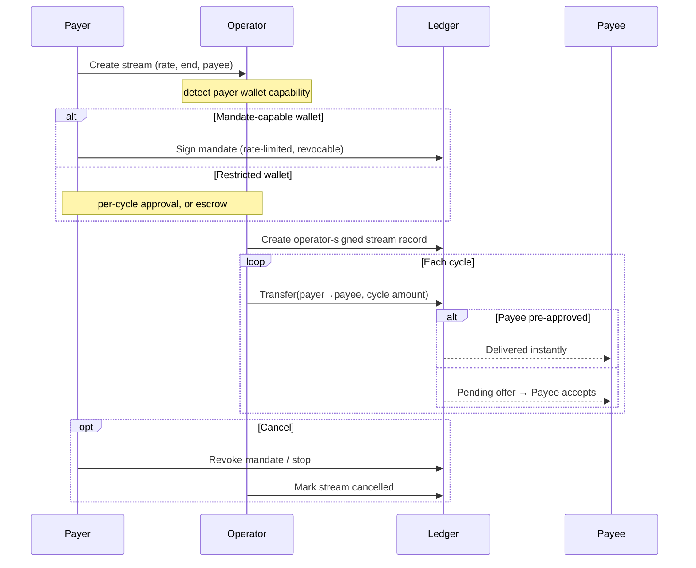

# Streaming Settlement Design

How value actually moves in a payment stream, why the design is
non-custodial, and how it works for any wallet on any node.

## What a payment stream is

A payment stream is a **two-party** relationship: a **payer** pays a
**payee** continuously over time, at a fixed rate, until the stream ends
or is cancelled. Nothing about that relationship inherently requires a
third party to hold or control the money.

This document describes a settlement design that keeps that property:
the money moves **directly** from payer to payee using the CIP-56 token
standard, an **operator** provides the application (schedule, automation,
and fee sponsorship) without ever taking custody, and **any** wallet can
be a payer or payee regardless of which node hosts it.

## Design principles

1. **Non-custodial by default.** No component other than the payer ever
   holds or controls the payer's funds. The operator is a facilitator,
   not a custodian.
2. **Operator as application provider.** The operator hosts the
   application package (DAR), runs the scheduler that fires each cycle,
   submits the transactions, and pays the network traffic. It is the
   only party that needs to run the application.
3. **Standard-first value movement.** Money moves over the CIP-56
   **transfer** primitive, which every token-standard participant
   supports. Custom application logic governs the *schedule*, never the
   *asset*.
4. **Capability-aware.** The funding mechanism adapts to what the payer's
   wallet can do, so the best available option is always offered and
   nothing is silently broken.

## Roles

| Role | Responsibility | Holds funds? |
| --- | --- | --- |
| **Payer** (sender) | Authorizes funding — once (a mandate) or per cycle | Yes — in their own wallet |
| **Payee** (recipient) | Optionally pre-approves incoming transfers; otherwise accepts each | No |
| **Operator** | Hosts the DAR, runs the executor, submits, pays traffic | **No** |
| **Registry / issuer** | Provides the asset's transfer rules (e.g. the DSO for Canton Coin) via disclosed contracts | No |

```
        authorizes funding                 receives value
Payer  ───────────────────►  Operator  ───────────────────►  Payee
(funds stay in wallet)     (schedules + submits,          (own wallet /
                            holds nothing)                  any node)
                                  │
                                  └── pays network traffic
```

## The money leg — direct transfer, not escrow

Each cycle moves value with the token standard's **transfer** primitive
(`TransferFactory_Transfer` → `TransferInstruction`). Per the CIP-56
interface definitions this choice is **controlled by the sender alone** —
the instrument admin is *validated* as the expected registry but is **not
a required signer**; it contributes the asset's rules through disclosed
contracts. A transfer is therefore a genuine two-party operation:

- the **sender** authorizes it,
- the **receiver** accepts it (or has pre-approved it, in which case it
  completes immediately),
- no operator or escrow agent is in the value path.

Funds never leave the sender's wallet until the transfer executes, and a
transfer settles cross-node to any receiver.

### Why not allocations / escrow

The token standard also offers an **allocation** primitive (lock funds
up front, settle later). Its settlement and cancellation choices are
controlled by **sender + receiver + executor** — a three-party
construction, and for some instruments the registry participates in
settlement as well. Allocations exist for **delivery-versus-payment**:
atomic multi-leg settlement coordinated by a settlement app (a DEX, an
exchange). A one-directional payment stream is not a DvP, so pulling in a
settlement executor and locking the payer's funds is pure overhead — an
extra liveness and trust dependency with no benefit.

**Streams use transfers. Allocations are reserved for the escrow funding
option below, where a wallet cannot do anything else.**

## The recipient side — preapproval

At stream creation the application checks whether the payee has a
**`TransferPreapproval`** for the instrument:

- **Has one** → every cycle's transfer completes instantly; the payee
  does nothing.
- **Does not** → each cycle lands as a pending offer the payee accepts in
  their wallet.

A preapproval is **receiver-signed** — the application cannot create it
on the payee's behalf. When it is missing, the application surfaces a
one-time prompt for the payee to enable it; afterwards all future streams
to that payee are instant.

## The sender side — funding by wallet capability

Moving the payer's funds on a schedule requires the payer's consent; that
is irreducible. What differs is the **shape** of that consent, and it is
chosen by the payer's wallet capability, detected at stream creation.

| Funding model | Custody | Hands-off? | Available to |
| --- | --- | --- | --- |
| **Mandate** (recommended) | none — funds stay in payer wallet | ✅ | Wallets that can sign application contracts |
| **Per-cycle** | none | ❌ (approve each) | Any wallet |
| **Escrow** | funds locked in a contract | ✅ | Wallets restricted to token-standard operations |

### Mandate (non-custodial, recommended)

The payer signs **one** application contract — a *mandate* — that grants
the operator a **rate-limited, revocable** authority to pull at most one
cycle's amount per period. The funds **stay in the payer's wallet**; each
cycle the operator constructs and submits a standard transfer just in
time, using the payer's delegated authority. The payer can revoke the
mandate at any moment, and a faulty or malicious operator can at most move
the scheduled rate — never more.

This is strictly better than pre-signing many future transactions (which
is impossible anyway: a prepared transaction binds to specific input
holdings and a time window, neither of which is known for a future
cycle). Sign once, run continuously.

The mandate is an application contract signed by the payer, so it is
available to any wallet that can **sign application-defined Daml** and
whose node **runs the application package** — self-custody wallets and
application-integrated wallets on participants that vet the DAR.

### Per-cycle (universal fallback)

The payer's wallet authorizes **each** cycle's transfer directly. Fully
non-custodial and works for **every** wallet, including custodial wallets
restricted to token-standard operations — at the cost of a per-cycle
approval.

### Escrow (for restricted wallets that want automation)

A custodial wallet that only speaks the token standard cannot sign a
custom mandate. Its one *sign-once* option is the standard **allocation**:
the payer locks funds up front and the operator releases them per cycle.
The lock lives in an on-ledger contract — **not** in an operator-held
wallet — so this is still not operator custody, but the payer's funds are
committed until released or withdrawn.

> **Deployment requirement.** Escrow settlement additionally requires the
> operator's participant to hold **settlement rights** from the
> instrument's registry (for Canton Coin, a featured-app style
> registration). Where those rights are not yet granted, escrow can be
> created but not settled — offer the mandate or per-cycle model instead,
> and label escrow accordingly.

## The stream record

The stream itself — its schedule, rate, and lifecycle state — is an
**operator-signed** application contract. Payer and payee are recorded as
**fields**, not as signatories or observers. This is deliberate:

- Only the **operator's** participant is a stakeholder, so only it must
  vet the application package.
- The payee (and a mandate-less payer) are **never stakeholders** on the
  application contract, so **their** nodes need nothing installed.

The record is the operator's bookkeeping/index; the authoritative value
movement is the stream of standard transfers, each independently visible
to its two parties and on the network's scan.

## Topology and package vetting

A Canton contract can only be created on a synchronizer where **every
participant hosting a stakeholder** vets the contract's package. That is
why the roles above are shaped as they are:

- **Receiving is universal.** A transfer makes the receiver a stakeholder
  only on a *standard* token contract, which every participant already
  vets. Any payee on any node can receive.
- **The application is the operator's concern.** Because payer/payee are
  not stakeholders on the stream record, only the operator's participant
  vets the application DAR.
- **The mandate is the one exception.** It is signed by the payer, so a
  mandate payer's participant must vet the application package — hence the
  mandate is for application-integrated / self-custody wallets, and
  restricted custodial wallets fall back to per-cycle or escrow.

## Trust and security model

- **No third-party custody** in the mandate and per-cycle models; funds
  remain in the payer's wallet until each transfer.
- **Bounded authority.** A mandate caps the operator at one cycle's amount
  per period; it cannot drain the payer.
- **Revocable.** The payer archives the mandate to stop the stream
  instantly, with no operator cooperation required.
- **Verifiable.** Each cycle is an on-ledger transfer, independently
  confirmable on the network scan; the operator's record is an index over
  those, not a source of truth about balances.
- **Operator is untrusted for funds.** The worst a faulty operator can do
  is stop paying (liveness) or, within a mandate's rate limit, pay on
  schedule — never move funds outside the granted bound.

## Lifecycle



## Endpoint reference

Value movement uses the token-standard registry endpoints, served
side-by-side at `v1` and `v2`. Route them through the validator's
scan-proxy (`/api/validator/v0/scan-proxy/registry/...`) or the registry
host directly.

| Purpose | Endpoint |
| --- | --- |
| Build a transfer | `POST /registry/transfer-instruction/{v1\|v2}/transfer-factory` |
| Accept / reject / withdraw an offer | `POST /registry/transfer-instruction/{v1\|v2}/{id}/choice-contexts/{accept\|reject\|withdraw}` |
| Instrument metadata | `GET /registry/metadata/v1/instruments` |

`transfer-instruction` is shape-compatible across `v1` and `v2`; the `v2`
factory choice arguments are `{ transfer, actors, extraArgs }` (the `v1`
`expectedAdmin` field is dropped in `v2`). The escrow path additionally
uses the `allocation-instruction` / `allocation` endpoints, which the
stream design only touches for the escrow funding option.

## Summary

- Streams move value with **direct token-standard transfers** — two-party,
  no escrow, no third-party custody.
- The **operator** hosts the application and pays traffic but **holds
  nothing**; payer/payee are fields on the stream record, so receiving
  works on any node.
- Funding is **capability-aware**: a non-custodial **mandate** for
  application-integrated wallets, **per-cycle** approval for any wallet,
  and **escrow** as the sign-once option for restricted custodial wallets
  (where the network grants settlement rights).
- The only irreducible requirement is the payer's own consent to fund the
  stream; everything else — hosting, scheduling, submitting, fees — sits
  with the operator.
